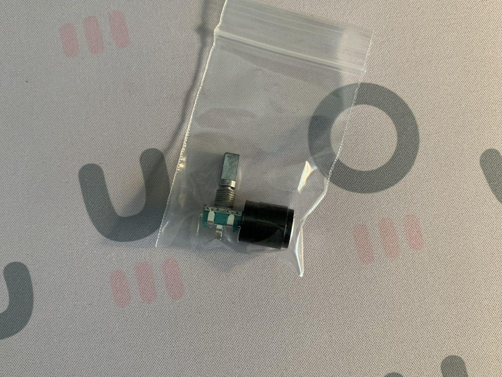

# Ristretto hub!

Here is a comprehensive hub for the Ristretto Keyboard, written by **Fruit**
 

## Repository Contents:
* firmware
    * everything firmware related including keymaps, hex's, and more!
    * Check out the [QMK Repo](https://github.com/qmk/qmk_firmware/tree/master/keyboards/ristretto) for big firmware releases.
* open source
    * all the pieces of this board that will be free for use (i.e. plate files, midplate stl, etc.)
    * *Please note:* if the file does not exist in here, it is not open source and unauthorized copying of the files via any medium is strictly prohibited.
    * midLayer.stl scale is fucked, scale it so z-axis is 10mm tall - you can also purchase one from [Noah K on his store](https://kiserdesigns.bigcartel.com/product/ristretto-midlayer)
* img
    * image files for this page.

## Table of Contents

* [prerequisites](#prerequisetes)
* [components](#components)
* [assembly](#assembly)

 

## prerequisites

There are some items you will need in order to build your Ristretto

### Required

* A soldering iron
* Solder
* A small phillips screwdriver

### Optional

* Flux - if you are not using leaded solder, flux is recommended
* a little bit of tape
* a sick [P3D Acrylic case](https://p3dstore.com/collections/40-or-smaller-acrylic-cases/products/ristretto-acrylic-gasket-mount-keyboard-case) from the [P3D Store](https://p3dstore.com/collections/40-or-smaller-acrylic-cases/products/ristretto-acrylic-gasket-mount-keyboard-case)! 

 

## components

Included in each kit is the following:
#### Bottom Plate

#### Switch Plate

#### Assembled PCB

#### OLED Module

* 0.91" I2C OLED
#### Encoder and Knob

* EC11 Encoder
#### Screws and Standoffs

* Screws are M2 x 6mm - 16 qty
* Standoffs are M2 x 10mm - 8 qty
#### Rubber Feet

## assembly
### Total Estimated Time: 1 hour

#### Before you begin!
Please test your PCB. These were all tested before shipping, but double check that all the switches work by shorting them with a pair of conductive tweezers. As soon as a soldering iron touches the board, I am no longer able to issue a refund/replacement. Please refer to the [terms and conditions](https://www.fruitykeeb.xyz/terms-and-conditions) listed on my site for more info.

Note about this guide: For this guide, I am building a board with the OLED and no encoder - instead of the encoder there is a switch in its place. I will still point out where the encoder goes.

PS. If you are using the [P3D Acrylic case](https://p3dstore.com/collections/40-or-smaller-acrylic-cases/products/ristretto-acrylic-gasket-mount-keyboard-case) (highly recommended!! it's super cool!!), make sure you follow [Jake's instructions](https://p3dstore.com/pages/revised-acrylic-gasket-case-build-guide) to put together your case!

### Step 0: Solder the Encoder (optional)

The encoder goes at the bottom middle of the PCB. **Make sure the legs stick through to the side with the all the components on it.**

####If you are millmaxing the board, do that now - **as well as stabilizers**. Check the KLE [here](http://www.keyboard-layout-editor.com/#/gists/95d1aea85be3f3f5c29b4fbeddd9893c).

### Step 1: Put some switches into the plate

I usually put 5 or 6 on each side in the locations shown, this just helps keep the plate up when you are putting in the rest. 

### Step 2: Flip the plate over and put the PCB on

Please be gentle as 5 pin switches will need some force because the tolerances are tight.

### Step 3: Solder those switches in place

### Step 4: Flip the board back over and insert the remaining switches

Here is where you do the thumb layouts... I may have been dumb and not put any notes *on* the pcb, but I'll drop that here. (I know, I am bad a ms paint)

### Step 5: Flip the board over again (flip flop flip flop) and solder all the switches

### Step 6: Flip the board back over again and insert the OLED module (optional)

Use some tape to hold this in until it is soldered.

### Step 7: Flip the board over yet again, solder in the OLED module, and add the screws and standoffs to the plate

This is kinda tricky as the tolerances are tight, but the legs should *just* poke through the PCB.

### Step 8: Add the bottom plate on and screw it in, add the rubber feet

I recommend putting the rubber feetsies right on the inside of the screws, but you can put them just about anywhere you want. 

What? It's not like I know where you live and will show up at your house one night and force you to put them in a decent location. But hey, you do you. :clap:

### Step 9: Add keycaps and drooool :cold_sweat:

Oh yeah, that's a hot board. Nice job :ok_hand:

Post some pics in the [Fruitkeeb Discord](https://discord.gg/Qzrua9V2Ec) and show off your hard work!!

> Keycaps used in pic is DSS Lights Out from RingerKeys
